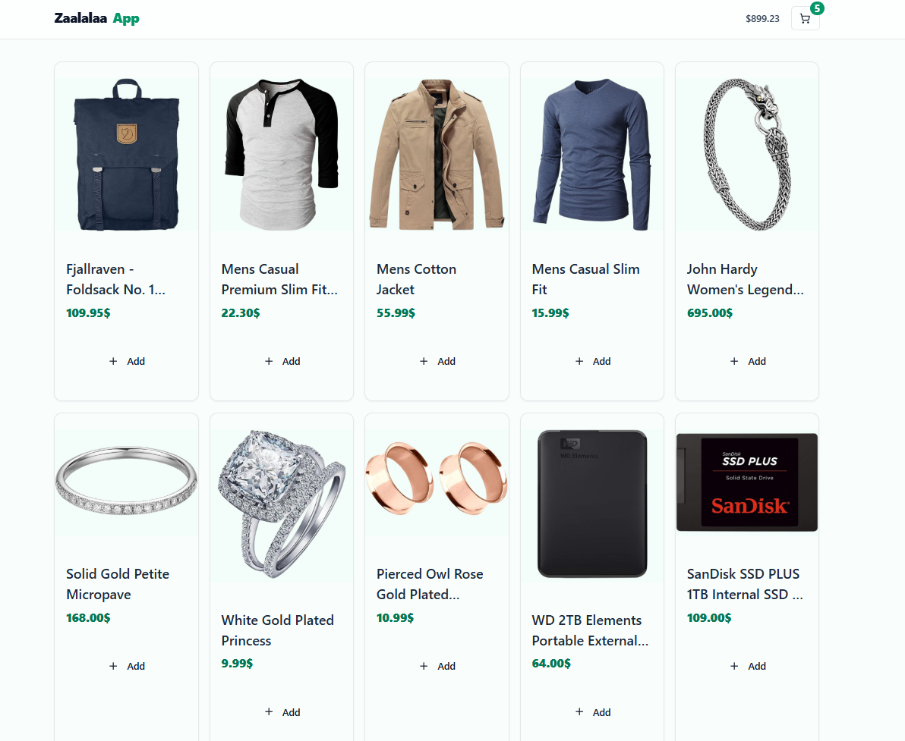
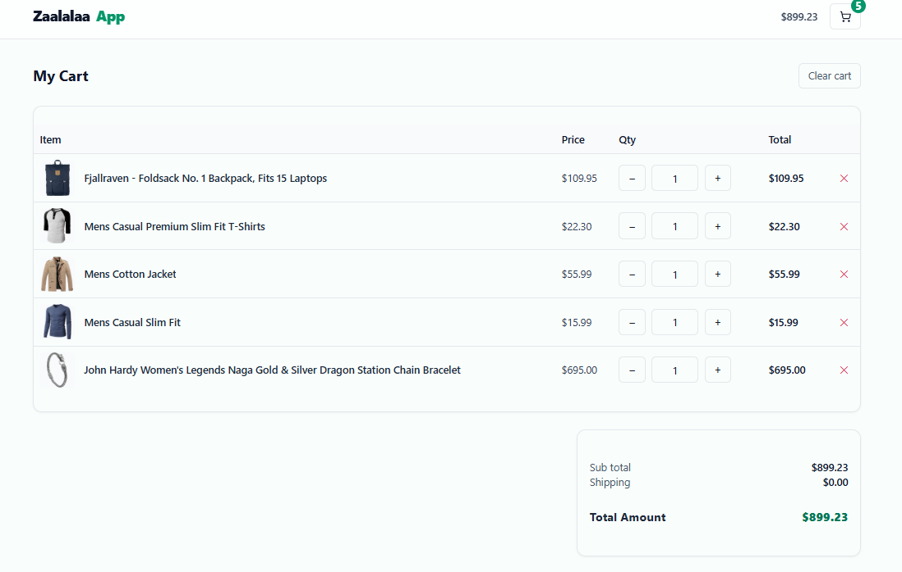

# 🛒 FreshCart — Modern Cart App (Next.js)

Cart sederhana yang modern dan responsif. Halaman awal menampilkan grid produk; ikon keranjang di navbar membawa ke halaman **Cart** berbentuk tabel ringkas. Proyek ini tersedia dalam dua pendekatan state:

- **`main`** → _Props Drilling_ (state di page, data diprop-kan ke child)
- **`zustand`** → _Global Store_ dengan **Zustand**
- **`ui-shadcn`** → versi Zustand + styling **shadcn/ui** + hover states

 

  
   
  <em>Halaman Home (produk grid dengan tombol Add)</em>
    
  
   
  <em>Halaman Cart (tabel ringkas tanpa tombol checkout)</em>

> **Catatan:** jika folder `public/preview` belum ada, buat lalu simpan screenshot sebagai `home.png` dan `cart.png`. Atau hapus bagian gambar di atas.

---

## ✨ Fitur

- Grid kartu produk dengan tombol **Add** (+ hover lift & zoom)
- Navbar dengan badge jumlah item & total harga _real-time_
- Halaman **/cart** berupa **tabel** (image, name, price, qty, subtotal, remove)
- Responsif (mobile → desktop)
- Aksesibilitas: fokus-ring, tombol & input ramah keyboard
- Desain modern: palet emerald/pastel, komponen **shadcn/ui**

---

## 🧩 Stack

- **Next.js 15** (App Router)
- **Tailwind CSS 3**
- **shadcn/ui** (Button, Card, Table, Input, Separator, Badge)
- **Zustand** (untuk branch `zustand` & `ui-shadcn`)
- **FakeStore API** – `https://fakestoreapi.com/products`

---

## 🗂️ Struktur Penting

